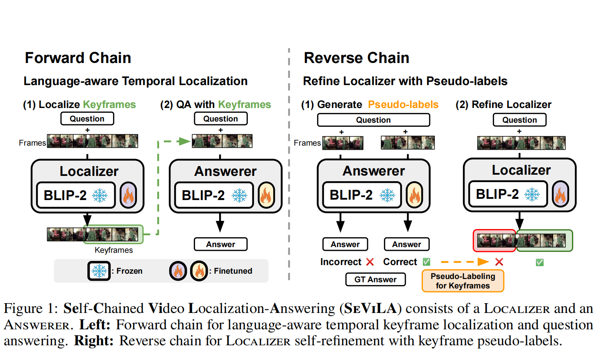
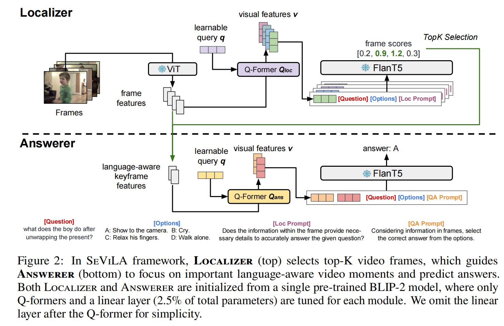
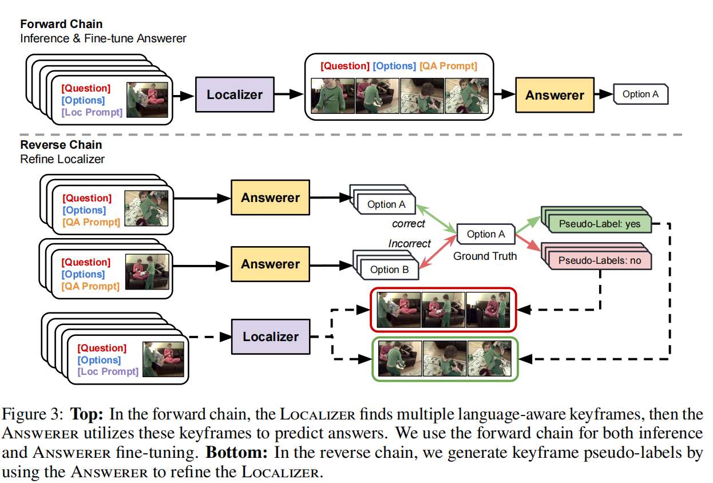

SeViLA笔记

[原文](https://proceedings.neurips.cc/paper_files/paper/2023/file/f22a9af8dbb348952b08bd58d4734b50-Paper-Conference.pdf)

**Framework:**

在向前传播的过程中：

Localizer通过给BLIP-2做prompt `“Does the information within the frame provide the necessary details to accurately answer the given question?”`

去筛选每一个视频帧

在反向传播的过程中：

生成关键帧伪标签来改善Localizer

**Method: SeViLA**

对于反向传播：
Answerer拿Localizer的每一帧去尝试回答问题，如果答案对了，那就是豪帧，如果不对那就不是，通过这一系列的二进制的伪标签来训练精进Localizer的选择

同时又会在这个基础上微调answerer

并且为了提升Localizer的能力还进行了迁移学习，在视频的时刻的检索与grounding任务上进行预训练

（在QVHighlights上预训练Localizer能力）
