<font size=8>A Survey on Multimodal Large Language Models</font>


[原文](https://arxiv.org/pdf/2306.13549)

<font size=5>**1 INTRODUCTION**</font>


LLM值得关注的能力：

```
 instruction following
 InContext Learning (ICL)
 Chain of Thought (CoT)
```

 同时zero/few shot reasoning在NLP任务上也表现出色

但LLM无法对vision做出处理


但是<font color=red>LVM</font>(`Large Vision Model`)弥补了这一点，但是推理能力落后


在MLLM出现之前，对于多模态的研究，可分为：

```
discriminative
generative
paradigms
```


<font size=5>**2 ARCHITECTURE**</font>

组成：

```
pre-trained modality encoder
pre-trained LLM
modality interface
```

`modality inerface`连接二者

同时有些MLLM还包含generator来生成不止文本的其他模态的内容

对于connector，分为三种：

` 1.projection-based 2.query-based 3.fusion-based `

前两者将features融为token(`token-level fusion`)

最后是的`feature-level fusion`

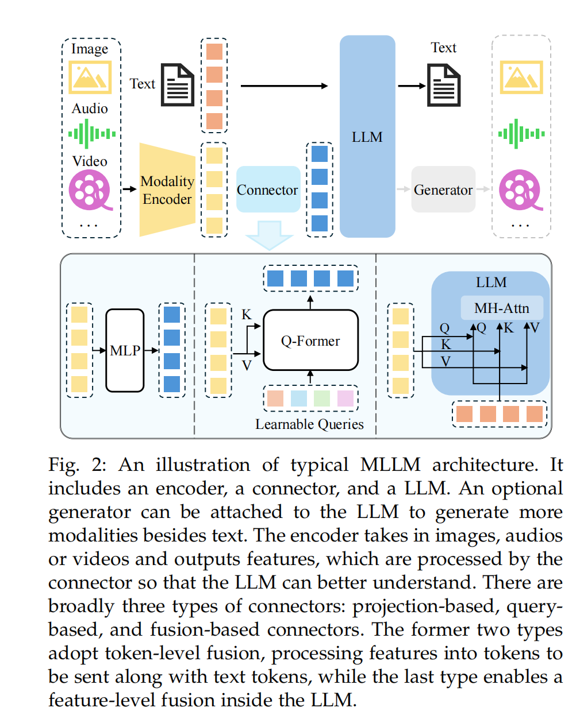


**2.1 Modality encoder**

一般使用预训练好的可以处理多模态的encoder

像CLIP就可以处理图片文本对


对于图片，经验结果是分辨率越高，表现往往越好。

对于**提高输入分辨率**的方法则分为：**直接提高**和**分区**

直接提高则是需要调整encoder去处理高分辨率的图片或者直接使用处理高分辨率的encoder

而分区则是将高分辨率的图片切成多块，每块可以被处理低分辨率的encoder处理

(MONKEY,SPHINX:将sub-images以及经过降采样的整张图片给encoder,以此能获得局部以及全体的features)


<font color=blue>同时经验上：training data的构成以及encoder参数大小相比于分辨率就没那么重要</font>

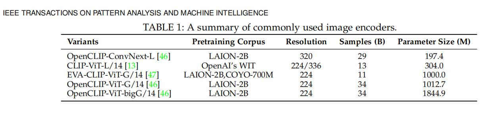


**2.2 Pre-trained LLM**


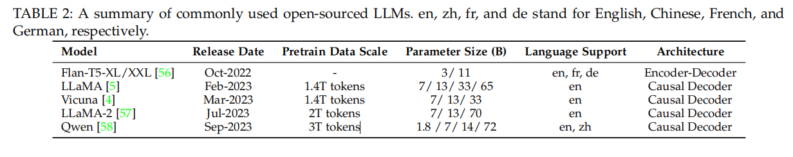


------------------------------------------------------------------------------------------------------------------------------

<font size=5>**来自网上资料的补充：**</font>

大模型主要架构分为三种：：prefix Decoder 系、causal Decoder 系、Encoder-Decoder。


1. **prefix Decoder 系**

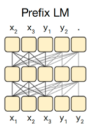


- 注意力机制方式：输入双向注意力，输出单向注意力 
- 特点：prefix部分的token互相能看到，属于causal Decoder 和 Encoder-Decoder 折中
- 代表模型：ChatGLM、ChatGLM2、U-PaLM
- 缺点：训练效率低


**2. causal Decoder 系**

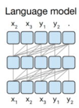

- 注意力机制方式：**从左到右的单向注意力** 
- 特点：自回归语言模型，预训练和下游应用是完全一致的，严格遵守只有后面的token才能看到前面的 token的规则
- 适用任务：文本生成任务效果好
- 优点：训练效率高，zero-shot 能力更强，具有涌现能力
- 代表模型：GPT-3，LLaMA-7B、LLaMa 衍生物


**3. Encoder-Decoder**

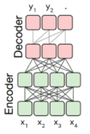


- 注意力机制方式：**输入双向注意力，输出单向注意力**
- 特点：在输入上采用双向注意力，对问题的编码理解更充分
- 适用任务：在偏理解的 NLP 任务上效果好
- 缺点：在长文本生成任务上效果差，训练效率低
- 代表模型：T5、Flan-T5、BART

------------------------------------------------------------------------------------------------------------------------------


与直觉相同的：模型参数越大，性能越好


**Mixture of Experts (MoE)** 可以做到在增加模型参数量的同时不增加计算代价,通过选择性地激活部分参数


------------------------------------------------------------------------------------------------------------------------------


网络资料补充：在有限的计算资源预算下，用更少的训练步数训练一个更大的模型，往往比用更多的步数训练一个较小的模型效果更佳。

- **训练挑战**: 虽然 MoE 能够实现更高效的计算预训练，但它们在**微调阶段**往往面临**泛化能力不足**的问题，长期以来易于引发**过拟合**现象。
- **推理挑战**: MoE 模型虽然可能拥有大量参数，但在推理过程中只使用其中的一部分，这使得它们的推理速度快于具有相同数量参数的稠密模型。然而，这种模型需要**将所有参数加载到内存中**，因此对内存的需求非常高。


------------------------------------------------------------------------------------------------------------------------------


**2.3 Modality interface**


<font color=green>引入的缘由：</font>

如果不引入connector，直接去训练一个端到端的LLM太耗费时间了，所以引入一个可以去学习的connector，将encoder的输出转化为可以提供给LLM输出的connector


根据多模态信息**融合方式**，可以将connector分为

`token-level fusion` 以及 `feature-level fusion`


<font color=blue>token-level fusion</font>

普遍可实施的方法是

准备一组可学习的query tokens，通过查询提取信息

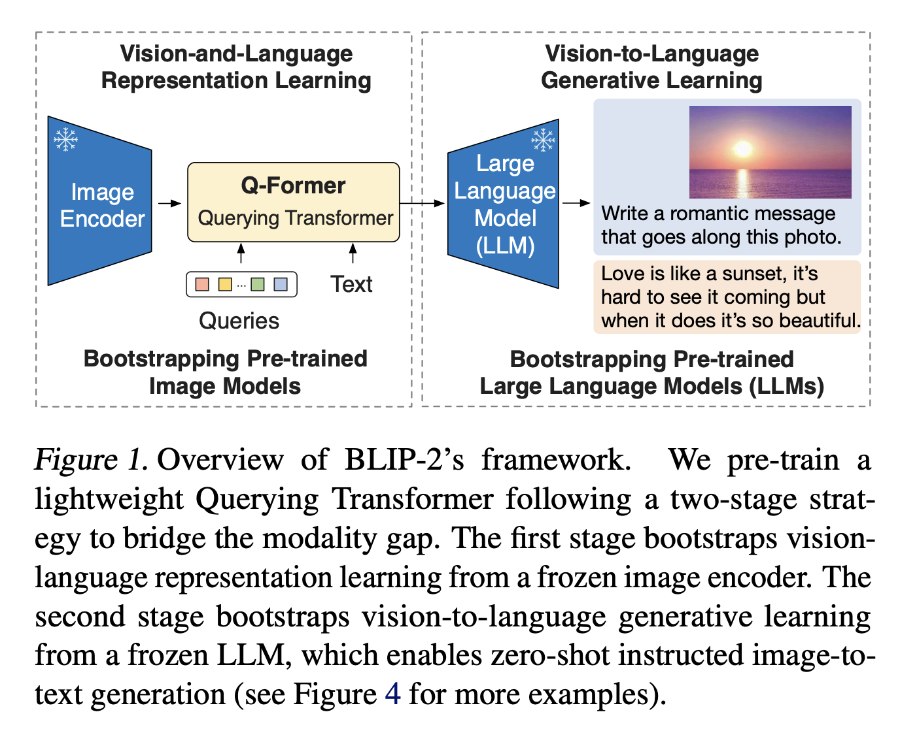


但像LLaVA系列则是实用几个线性的MLP，处理visual tokens，将它与word embedding对齐


<font color=blue>feature-level fusion</font>

为了使得视觉以及文本特征能够深层次地交互以及融合，需要引入额外的模型。


例子：

*Flamingo*引入额外的cross-attention layers 在LLM冻结的transformer层

*CogVLM* 在每个transformer层加入visual expert module来使得

文本和视觉特征能够交互融合

*LLaMA-Adapter*引入learnable prompts到transformer layer中

......


相较于encoder和LLM，它的参数较小


**Expert Model**

除开使用interface，视同expert models也可以连接多模态

直接讲多模态的信息转化为文本描述。

但是这种方式非常直球，会带来信息上的损失


<font size=5>**3 TRAINING STRATEGY AND DATA**</font>

MLLM的训练过程分三阶段：

```
 pre-training
 instruction-tuning
 alignment tuning
```

每个阶段需要不同类型的data以及完成不同目标


**3.1 Pre-training**


*3.1.1 Training Detail*

调整连接不同的模式以及学习大量的多模态的知识


Pre-train需要大量的成对文本数据，譬如：caption data

(caption pairs用文本描述图片，音频，视频)

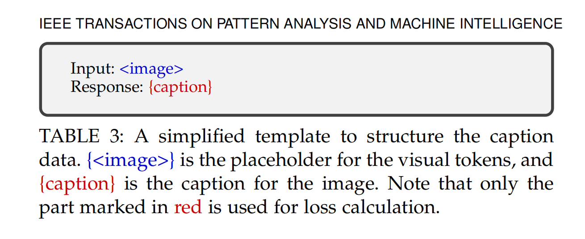

给定一个图片，自回归地去输出对于这张图片的描述

但一般情况下不去再作pre-train，而是用pre-train好的的LLM以及encoder，去重点train的是learnable interface


但也有一些方法不去冻结pre-train模型，以此能够获得更多去对齐(alignment)的训练参数


*3.1.2 Data*

预训练的语料可分为*coarse-grained data*（粗颗粒数据）以及*fine-grained data* （细颗粒数据）


*Coarse-grained caption data*

特点：
数据量很大

从网上爬去的，标识(captions)大多短，并且噪声多，但是也可以通过filter来洗数据(用CLIP滤掉图文相似度低于阀值的pair数据)

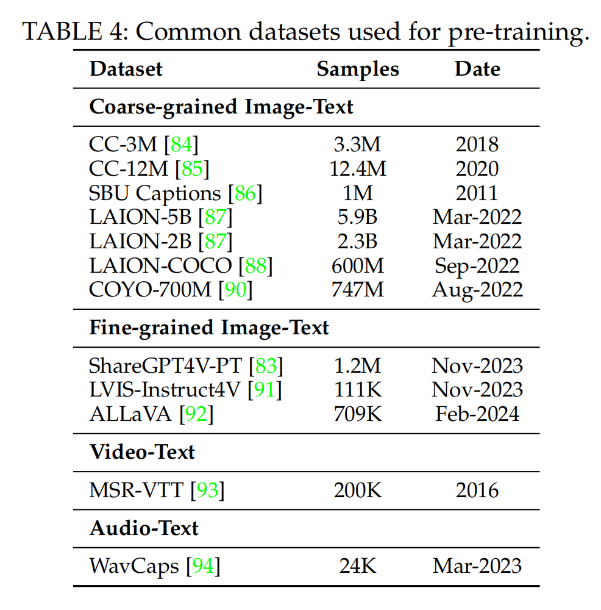

而fine-grained data往往很贵，但也有通过先train一个captioner（字幕机）,然后再通过字幕机，再去合成更多的数据

（譬如：ShareGPT4V）


**3.2 Instruction-tuning**


*3.2.1 Introduction*

<font color=red>instruction</font>:对于任务的描述


通过让机器理解instruction，理解需求，完成任务，LLM有泛化能没有见过的新instruction并且完成它。这也由此迸发了zero-shot

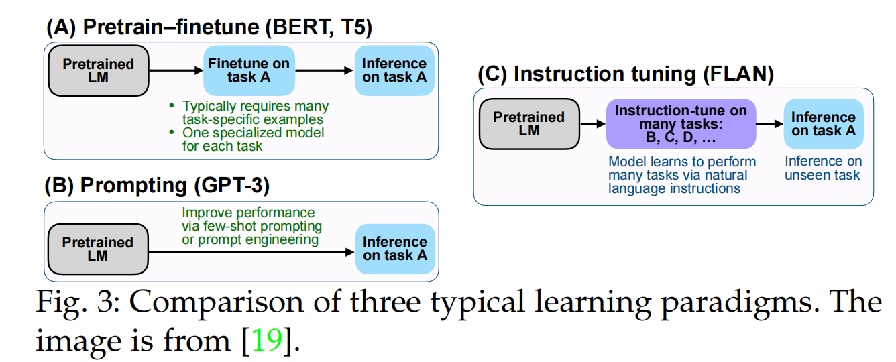


1.对于pretrain-finetune，它对于数据依赖性强。一个特定的任务对应需要一个特定的数据去做微调


2.prompting则没那么依赖特定任务的数据，更多是通过prompt来完成特定的任务，但是在zero-shot的情况下，表现则泯然众人矣了。


3.而instruction tuning更聚焦对问题的泛化能力，而非某个特定的问题，它能够去解决未看过的instruction


*3.2.2 Training Detail*

instruction data的模版：

当然结构相对灵活

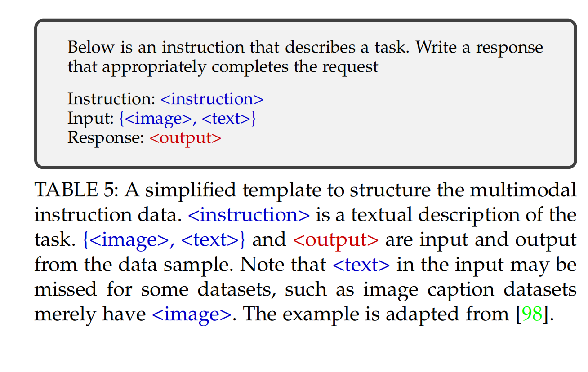

对于一个三元组：

$$(I,M,R)$$. I代表Instruction,M代表Multimodal input，R代表ground truth response

所以损失函数也可以表示为：
$$
L(\theta)=-\sum_{i=1}^{N}log p(R_{i}|I,R_{<i};\theta)
$$
N代表ground-truth response长度


*3.2.3 Data Collection*


**Data Adaptation.**

任务特定数据集通常包含丰富且高质量的数据，可以使用现有的高质量数据集来构建指令格式化的数据集。


**Self-Instruction.**

通过机器自己生成一些instruction-tuning data来，以此满足灵活性，多样性，以及人力低成本

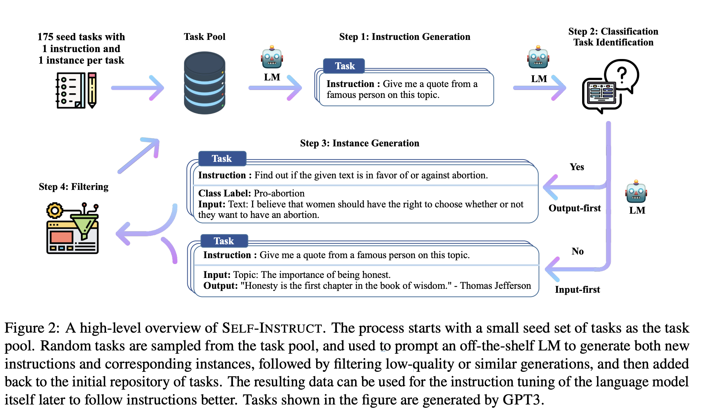


**Data Mixture.** 

将纯文本对话 数据以及多模态数据混合，然后利用混合数据来进行训练。


*3.2.4 Data Quality*

少量高质量的数据比低质量少量的数据的效应要好。对于instruction-tuning data而言：**质量大于数量**


数据质量的两个方面:**Prompt Diversity** 和 **Task Coverage**

（提高instruction的复杂度 比 提高任务的多样性以及精细的空间注释 更有利）


**3.3 Alignment tuning**

需求：与人类的意志统一，就是不仅内容上正确，还要和诸如道德，安全等方面统一


主流方法：

```
RL with Human Feedback(RLHF)
Direct Preference Optimization(DPO)
```


*3.3.2 Training Detail*

**RLHF**:

三步：

1) <font color=blue>*Supervised fine-tuning.*</font>:微调预训练好的模型，在RLHF中微调的模型称为：`policy model` ,有时这一步不作，因为可以放到instruction tuning阶段完成
2) <font color=blue>*Reward modeling.*</font>对于一组数据 $$$(x,y_{w},y_{l})$$ x是prompt，$$y_{w}$$ 是希望得到的response，$$y_{l}$$ 是极力避免的response。此时目标就是训处一个reward model能够对于每一个response给出的reward都很“公正”,越接近预期的reward分越高，相反的reward越低
3) <font color=blue>*Reinforcement learning.*</font>使用PPO算法来优化决策模型


**DPO**

用一个二元分类的classifier去学习人类偏好label

DPO不用去train一个reward model

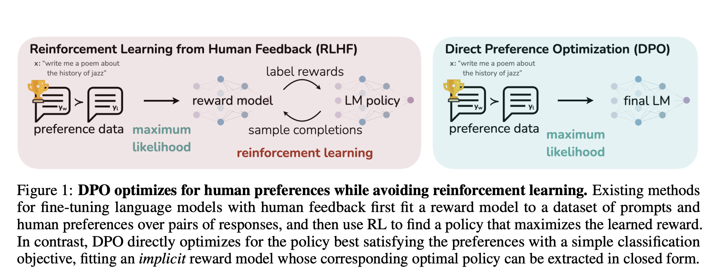

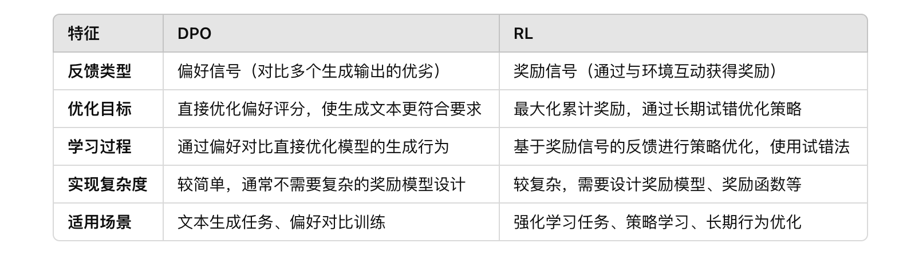

*3.3.3 Data*

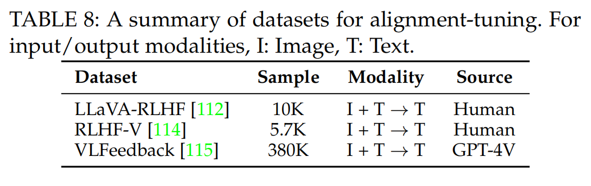


<font size=5>**4 EVALUATION**</font>

评估分为两个流派：
Closed-set,open-set

**4.1 Closed-set**

对于一个问题的回答预定好在一个限定的范围内

评估分为两种：

Zero-shot,finetuning

Zero-shot选择一大波来自各个任务的数据集并将它们分为held-in和held-out两份数据集，在held-in数据集上调整后，利用held-out数据集来评估

finetuning是通常直接在某个任务集上作评测

**4.2 Open-set**

对于问题的回答可以更灵活

评价方式分为：人工打分，GPT打分，案例分析


<font size=5>**6 MULTIMODAL  HALLUCINATION**</font>

<font color=blue>**multimodal hallucinations**</font>

三种：

*Existence Hallucination*:无中生有

*Attribute Hallucination*:属性幻觉，物体存在，但是它的属性弄错

*Relationship Hallucination*:物体之间的关系错误


**6.2 Evaluation Methods**


*CHAIR*: 检测hallucinated对象在所有对象中的**占比**

*POPE*： closed-set，提供**二元的查询**特定的对象是否存在

*HaELM* 使用**text-only LLM**，对照caption来自动判断hallucination

*FaithScore* 将描述性子句**分解**并分别评估每个子句的流程，对模型产生的字幕进行评估。

*Woodpecker* 使用**GPT-4V** 直接基于图像评估模型的响应，从而更准确地判断模型是否产生幻觉。


**6.3 Mitigation Methods**

三种思路：

```
pre-correction
in-process-correction
post-correction
```

**Pre-correction.** 把特定的**数据**收集过来然后再微调

**In-process-correction.**从**结构设计**上以及特征表示上去弥补改进

**Post-correction.** 在输出生成后对幻觉进行补救


<font size=5>**7 EXTENDED TECHNIQUES**</font>


**7.1 Multimodal In-Context Learning**

<font color=blue>ICL特征</font>:1.不同于传统监督学习从大量的数据中学出一个模式，ICL核心在从比喻中学

2.training-free,可以很灵活地添加到其他框架中，与ICL紧密相关的技术则是instruction-tuning


------------------------------------------------------------------------------------------------------------------------------

网络资料补充：提供任务相关的示例或上下文信息，模型能够立即理解当前任务并生成合适的输出，而无需进行传统的训练过程或额外的微调。模型并不会在学习过程中改变其参数，而是依赖于**输入的上下文信息**来进行任务执行。

与传统的**监督学习**或**微调**方法不同，ICL 允许语言模型在给定任务的上下文中**即时“学习”**如何执行任务。这种能力依赖于预训练模型在大量数据上学到的广泛知识和模式识别能力。

------------------------------------------------------------------------------------------------------------------------------

**现学现用**

在MLLM中，通过加入演示，M-ICL可以去学习多模态上下文

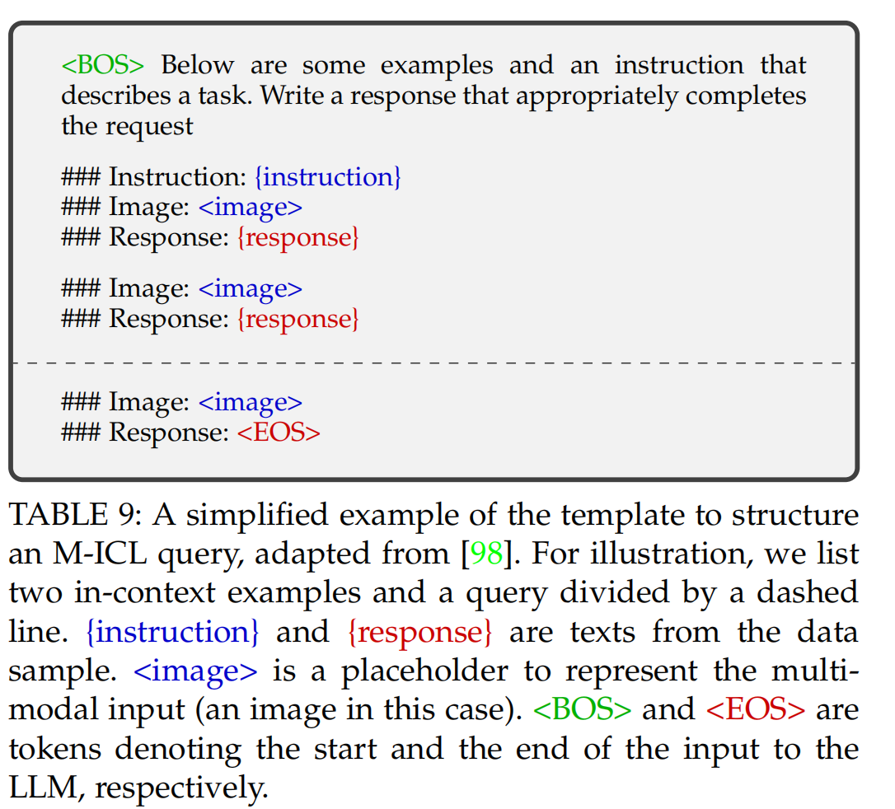


**7.2 Multimodal Chain of Thought**

一系列中间步骤的分析

不止是输出一个答案，还有推理的过程

*7.2.2 Chain Configuration*

结构与长度是推理链的重要方面，

结构上分为单一链和树状链，单一链用地更广法。对于树状链，做法是将问题分割成多个子问题

长度上分为自适应的和预定义的，自适应的需要LLM自行决定什么时候定制推理

*7.2.3 Generation Patterns*

两种模式：

`infilling-based` 根据周围来进行推理（比较接近的前后文）

`predicting-based` 根据`instructions` 以及先前的`reasoning history` 来推理


**7.3 LLM-Aided Visual Reasoning**

tool-augmented LLM 可以调用外部的工具来协助完成任务，由此

引出使用外部工具或视觉模型来完成视觉推理工作

training paradigms也同样分为`finetuning` 和 `training-free`


在`LLM-Aided Visual Reasoning` 中LLM的作用：

<font color=blue>LLM as a Controller</font>:将任务切割；利用CoT的能力将任务分派

<font color=blue>LLM as a Decision Maker</font>:情景在多轮对话中，根据目前的内容以及历史记录来决定是否可以完成这个需求；总结答案并回馈

<font color=blue>LLM as a Semantics Refiner</font>:语义精炼器

（refiner：蒸馏器）


**8 CHALLENGES AND FUTURE DIRECTIONS**
有待发展的：

1.long-context的局限性，导致处理长视频理解，长文本文件（图片文字穿插）

2.更复杂的instructions的遵循能力

3.M-ICL,M-CoT都还处于低级阶段


