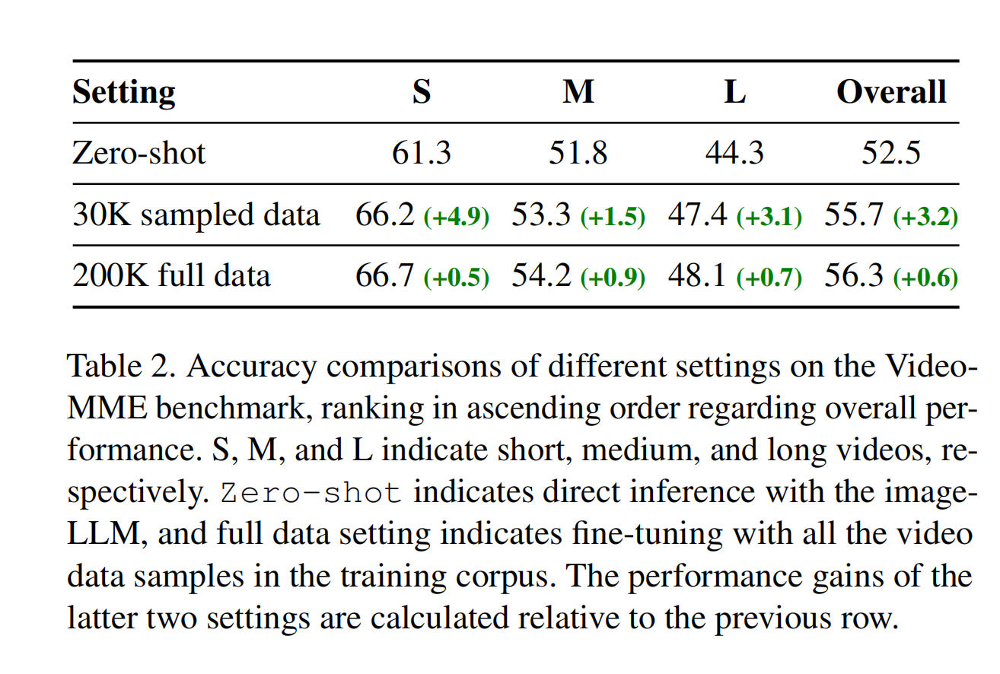
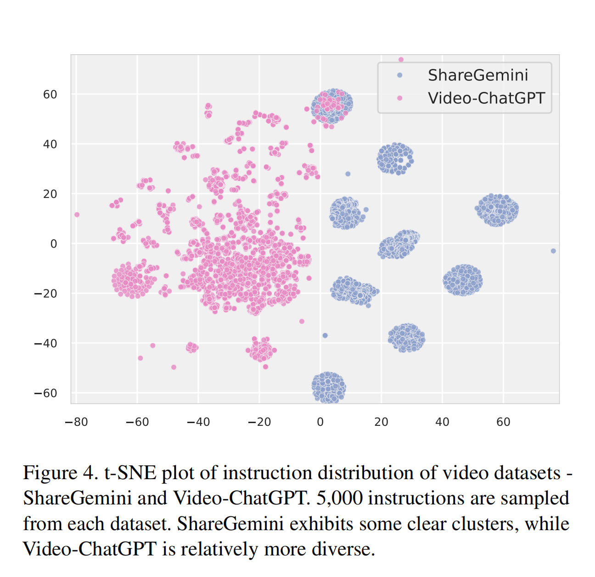
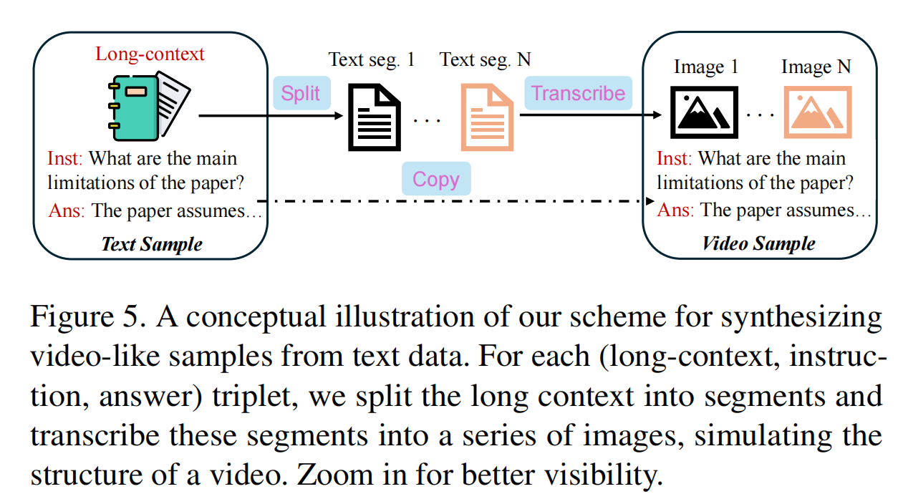
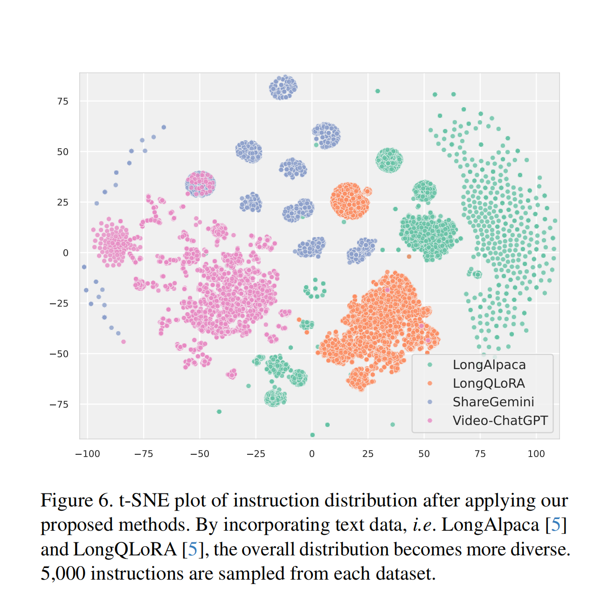
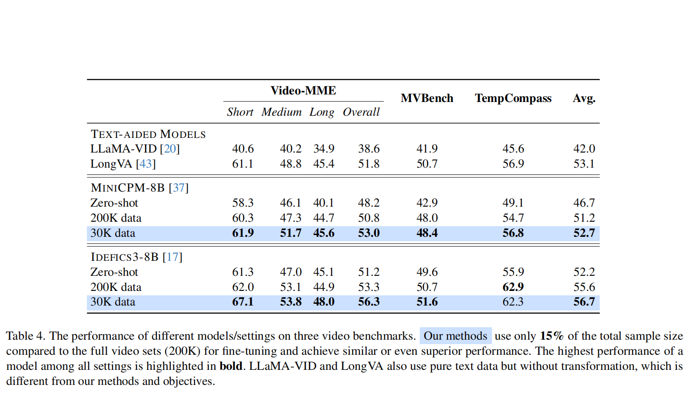

<font size=8>T2Vid笔记</font>


[T2Vid论文](https://arxiv.org/pdf/2411.19951)

few前言：

MLLMs很强，现在在video理解上，现在基于pre-train image-LLMs上的进一步发展两大做法：**zero-shot inference**和用**video data**进一步微调


Zero-shot inference的2大局限性：泛化能力有限，时间维度上理解也比较欠缺

对于fine-tune:又存在着单纯使用所有的样本学习率很低的问题，主演原因在于instruction的多样性不够

从而针对这个问题提出T2Vid

<font color=red>T2Vid干嘛？</font>

合成video-like data,以此丰富instruction diversity


使用image-LLM作微调，

<font size=5>1.Introduction</font>


**在定量和定性分析的发现**


1.context能看到的范围是有限的，因为这个局限性，即使视频增加帧数还是难以去生成更长的视屏

2.image-LLM没有理解帧与帧之间的关系

data agumentation行不通，所以放眼于微调

3.微调中由于corpus缺乏多样性，train起来效果不大行，从而引出合成视屏

4.现有数据：`(long-context,instruction, answer)`


<font size=5>2.Related Work</font>


**2.1 Multimodal Large Language Models**

Multimodal Large Language Models深受学术界和工业界的青睐，随着GPT4的产生，也越来越多的开源的Multimodal Large Language Models得以产生，以下便有几款介绍：

<font color=red>Image-LLMs</font>:在原基础上加强它对图像的inference能力。训练上主要两个阶段：image-text alignment training和instructions tuning

<font color=red>Video-LLMs</font>: 对于image-LLMs的衍生，诸如：

Video-ChatGPT,VTimeLLM,PLLaVA,LLaVA-NeXT-Video

在原基础上作微调，提高视屏理解力


同时还有其他研究，alignment, fine-tuning，然后将video和图片混着train


**2.2 Zero-shot Inference for Video Understanding**

另一条路线，整zero-shot inference(training-free)

诸如：

IG-VLM,它会调整平衡图像的分辨率和样本总量

SF-LLaVA：双流设计，慢分支更多是提取空间上的feature，它的帧率较低，快分支相反

Video-LLM:相较于前二者，它更多是在prompt上下功夫


局限性：上面都是在老QA上测的，任务都比较单一，而且对于问题的理解与解决比较浅尝辄止

随着MLLMs的兴起，一个更powerful，能对理解能力，复合能力要求更高的benchmark愈发重要


<font size=5>3.Model Formulation</font>

(模型设计)

MLLMs:<font color=red>encoder,connector,LLM backbone</font>

<font color=green>三步走</font>:

encoder提取视觉features

connector将视觉信息映射到text-embedding space

将二者一起送给LLM backbone，然后得到response


论文使用的image-LLMs:

```
Mini-InternVL-Chat-4B-V1.5(InternVL hereafter)

MiniCPM-Llama3-8B-V2.5(MiniCPM-8B hereafter)

Idefics3-8B-Llama3(Idefics3-8B hereafter)
```

都是instruction-tuned models

**为了得到更好的分辨率输入**

这些模型都使用了修补技术(patchifying technique)和分辨率的动态调整(dynamic resolution scheme)


<font size=5>4. Evaluation Setup</font>

引入Video-MME , MVBench, TempCompass作为benchmark

<font color=red>Video-MME</font>:专门为video-LLMs设计的。有不同长度的视屏，而且视屏没字幕。

<font color=red>MVBench</font>:任务涵盖perception（感知）, cognition（认知），视屏源自于先前的benchmark

<font color=red>TempCompass</font>:更倾向于精细的的时间方面features


<font size=5>5.Motivation</font>


**5.1. The Limitations of Zero-shot Reasoning**

通过zero-shot inference，image-LLM能够比更大的video-LLM表现得更好

之所以更好是因为使用了patchifying(图片剪切成许多子图片)免去了vision encoder的大规模微调


<font color=red>划重点!!!</font>:对于一个图片，它被切割成很多个子图，model通过一系列的子图去理解一张图片，对于一个视屏，它是由一连串的帧构成。通过理解这一连串的帧去理解整个视屏

这种**结构上的相似性**使得image-LLM可以适用于frames且不需要做vision encoder的fine-tuning


对于Image-LLM，一开始帧数越大，正确略越高，但是有一个上界，之后帧数的增加就没什么变化

**attend-aggregate pattern**

这种方式缺乏对时间上的理解，它是将各个帧相对独立地理解，汇总。而非帧与帧之间的关系


**5.2 The Pitfalls in Fine-tuning**

(pitfall:陷阱)

由于上述zero-shot inference结构本身的不足，我们曲线救国，fine-tuning来解决问题


<font color=green>Dataset</font>:用ShareGemini dataset(caption dataset)和 Video-ChatGPT dataset(instruction dataset)，并且每个视屏都是1FPS


在使用较低学习率进行微调后发现medius length和large length的视频效果不大好，training corpus视屏都比较短（ShareGemini普遍小于30秒）(Video-ChatGPT普遍不超过3.5分钟)(但是medium 4-15分钟，long30-60分种)



ShareGemini呈现9个clusters,但是这全部都是从9个模版得来的，只是“Describe this video in detail.”的变体，instructions diverse还是不够。



总结就是：

**1.training corpus时间面对medium与long benchmark而且还是不够看。**

**2.instructions的多样性不够**


<font size=5>6.Out Methods</font>




就是将文本切割成许多片段，然后转化成image，原本文本数据的

`(long-context,instruction,answer)`变成`(images,instruction,answer)`

生成的data分布：




<font size=5>7.Evaluation on Proposed Methods</font>


**7.1Ablation on Different Data Compositions**

消融实验结果：


