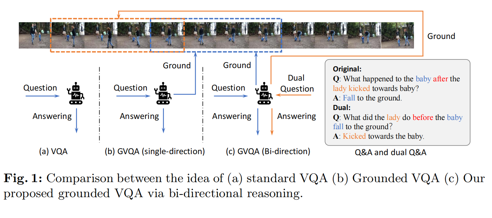
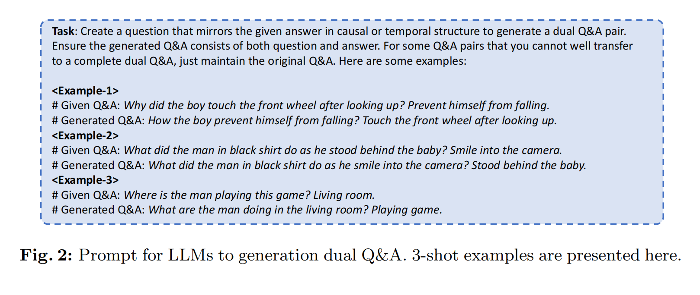
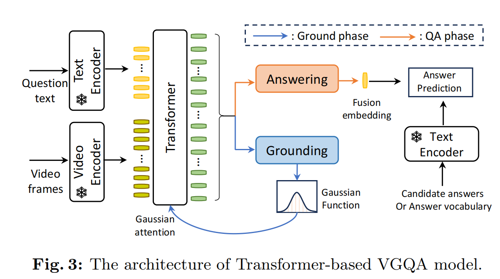
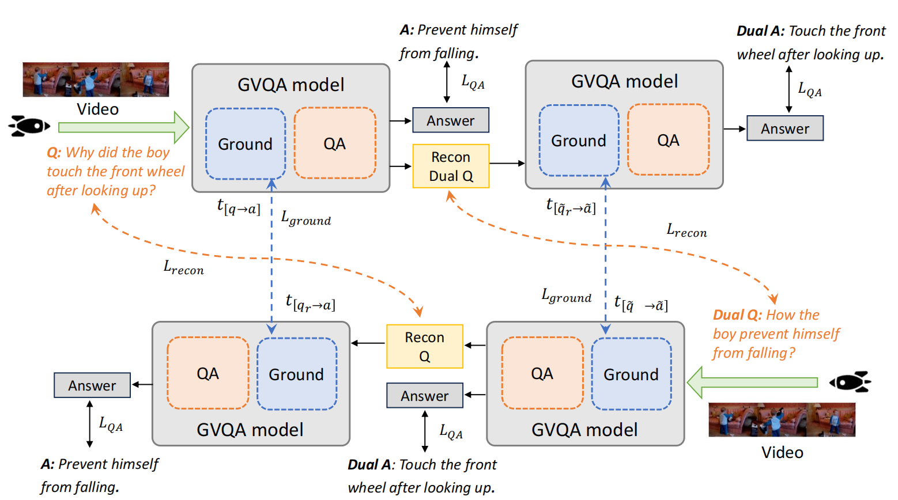
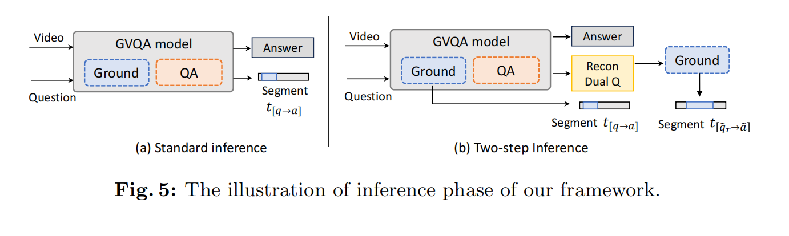
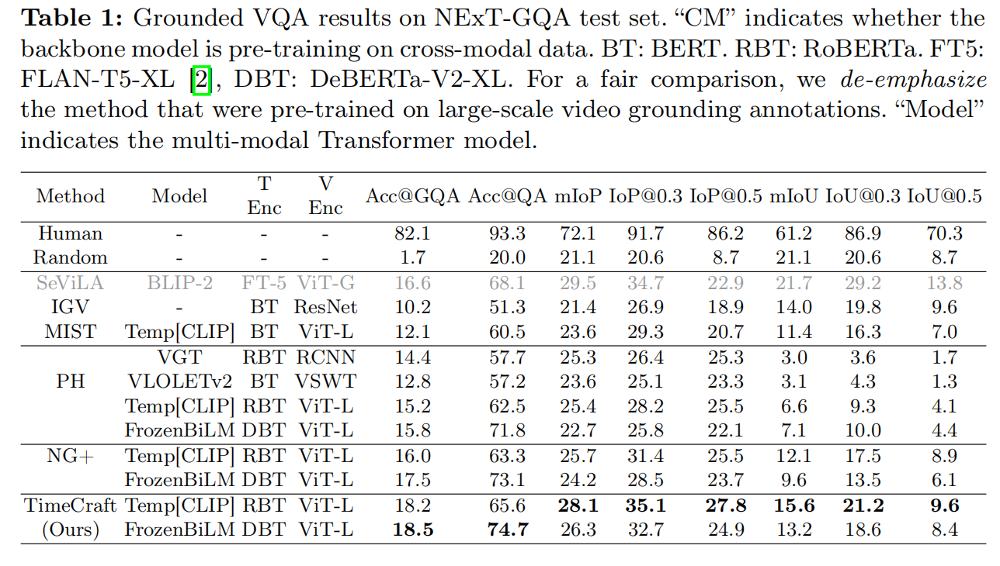
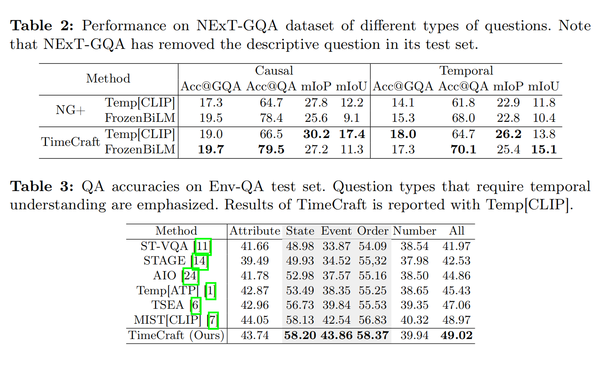
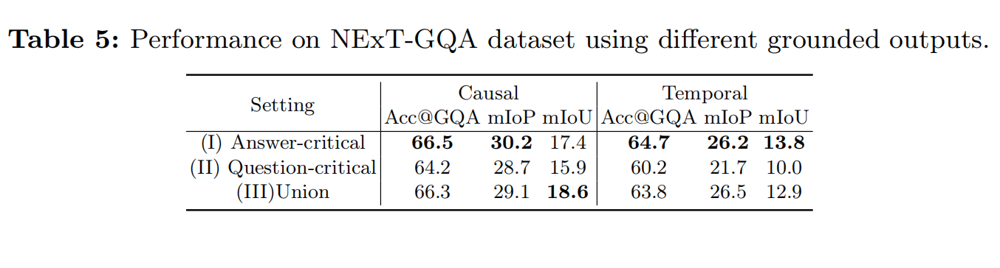

<font size=8>TimeCraft笔记</font>

[原文](https://www.ecva.net/papers/eccv_2024/papers_ECCV/papers/00720.pdf)

<font size=5>Introduction</font>


NExT-GQA引入新的任务，不仅仅是回答问题，而且还要提供作出判断的video

*Grounded Video Question Answering(GVQA)*

**Weakly-supervised Video Grounding**

<font color=blue>WSVG</font>:weak-supervised grounding 通过语言查询来定位

WSVG有两种：*MIL* (based methods)

将与visual-language对 匹配的对 对齐，不匹配的对 拉远（GCG）

*reconstruction-based methods*

将提案根据重构的距离于loss来排序，最能重构的作为最匹配的


早期WSVG依赖于滑动窗口在时间维度上生成多个提案

现在更多使用可学习的高斯函数来生成提案


来自于AI的补充：

```
1.Grounding：
含义：指模型在回答问题时，能够定位到视频中的具体片段或区域，建立问题与视频内容之间的关联。
作用：提升模型的可解释性，使其回答基于视频中的具体证据。

2.Uniform：
含义：指模型在处理视频和问题时，采用均匀或一致的策略，如均匀采样视频帧或对问题表示进行统一处理。
作用：简化模型设计，确保处理方式一致，避免偏差。

3.Oracle：
含义：指在实验中使用理想化或完美的信息，通常用于评估模型的上限性能。
作用：提供性能基准，帮助研究者了解模型的理论上限。

总结
Grounding：关联问题与视频内容。
Uniform：采用一致的视频和问题处理策略。
Oracle：提供理想化信息，评估模型上限。
```


**2.3 Weakly-supervised Grounded Video Question Answering**

一些VQA方法通过采用时间或空间注意力机制，隐式分析VQA模型的可靠性。MIST尝试通过将这一过程框架化为时空注意力机制来识别关键帧。VGT从因果角度显式学习如何定位关键帧。SeViLA集成了BLIP-2来开发一个基于视频的VQA模型


<font size=5>**3 Method**</font>



为什么这么做：

Q->A这种单映射很可能就会掩盖，重叠语言上的偏差以及寻常的感官知识，它会带来捷径效应

最终VLM可能利用这些来发掘到捷径效应




采用transformer-based VQA:



$a^{\star}=argmax_{a\in A} \Omega (a|(v,q),A)$

$\Omega$ 是transformer


将高斯预测器加入到transformer中，这里的高斯预测器的组成就是线性层的transformer，它接收到融合的多模态信息后预测 $\sigma$ 以及 $\mu$

然后生成高斯函数后，将问题和video的token与高斯注意力权重绑定并反馈给QA

$a^{\star},t^{\star}=argmax_{a\in A}\Omega (a|(v_{t}),q,A)$


训练时，现根据问题与答案，生成原有QA的另一种有A->Q的另一对，

然后给定这两对QA，要保证1.保证 $L_{QA}$ 小

2.布置一个任务: **dual question reconstruction** 

reconstruction head放在  $\Omega$ 的最后一层，然后将重构后的答案再给同样的GVQA并再做预测

在这种`GQA-reconstruction-GQA` 的流程同时也在有另一条线在跑

*training pipeline:*



对照上面的图，可以明白下面的loss function:

$L_{ground}=KL(t_{[q\to a]}\|t_{[q_{r}\to a]})+KL(t_{[\tilde{q}\to \tilde{a}]}\|t_{[\tilde{q_{r}}\to \tilde{a}]})$

两个高斯分布间的KL divergence可以如此计算：

$KL(t_{1}\|t_{2})=log(\frac{\sigma_{2}}{\sigma_{1}})+\frac{\sigma^{2}_{1}+(\mu_{1}-\mu_{2})^{2}}{2\sigma^{2}_{2}}-\frac{1}{2}$

然后去收敛重构的文本

$L_{recon}=L2(f_{\tilde{q}},f_{\tilde{q_{r}}})+L2(f_{q},f_{q_{r}})$

并最后的：$L_{QA}$

$L=L_{QA}+\alpha L_{recon}+\beta L_{ground}$


*inference framework*



<font size=5>**4 Experiments**</font>

**评测指标：**

(1)<font color=red>*mIoP:*</font> 评测预测的时间窗口是否在ground truth中

(2)<font color=blue>*mIoU:*</font> 评测预测时间与ground truth之间的重叠

(3)<font color=green>*Acc@GQA:*</font> 正确回答问题并且视觉定位的占比

(4)<font color=purple>*Acc@QA:*</font> QA任务的标准指标，正确回答问题的占比




Temp[CLIP]是在NExT-GQA上从头开始训的，grounding能力很强，但是FrozenBiLM保留了在跨模态上训练的权重，NExT-GQA上表现的优秀主要归功于QA能力




**Grounding question or answer?** 


上图(b)第一个gorund输出的为answer-critical moment，第二个ground输出的标记为question-critical moment

那么定位可以有三种方法：

(1)拿answer-critical moment来定位结果

(2)拿question-critical moment来定位结果

(3)结合(1)和(2),union

*结果：*


