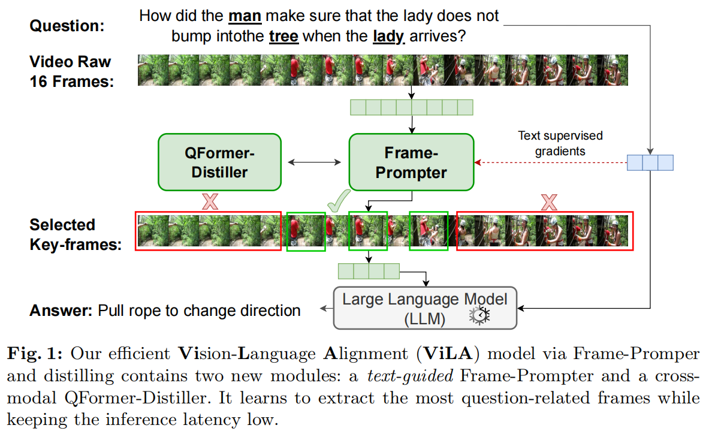
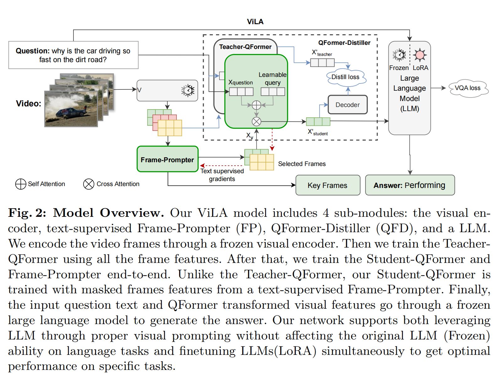
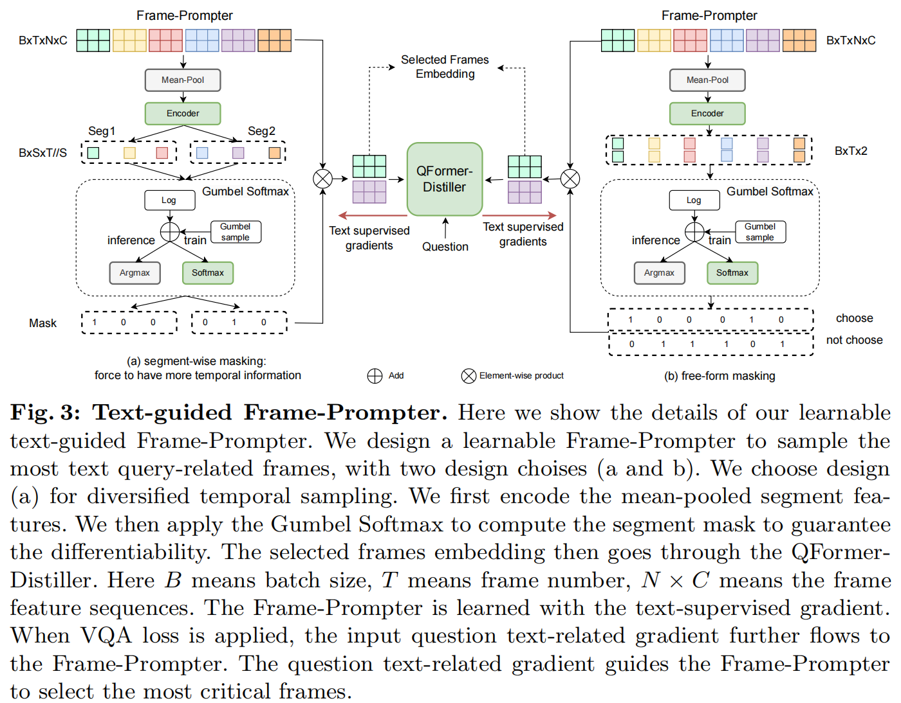
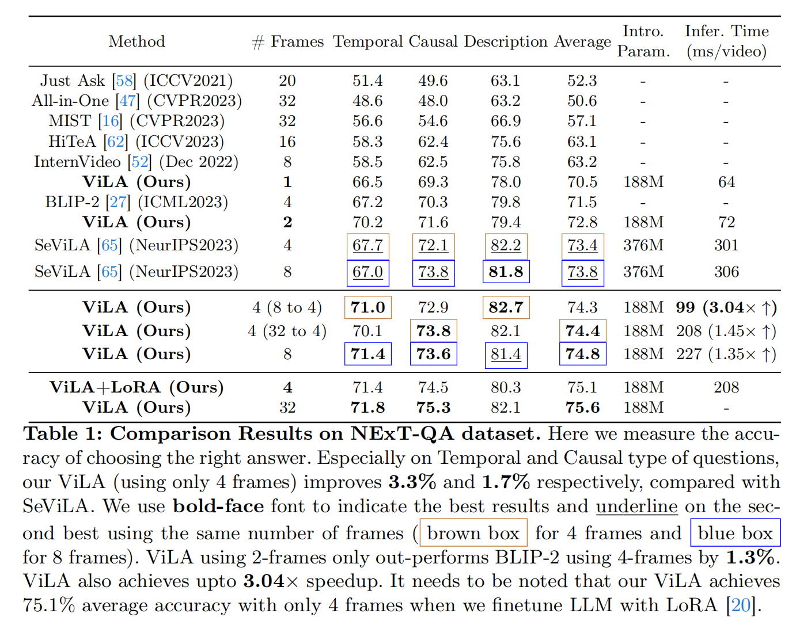
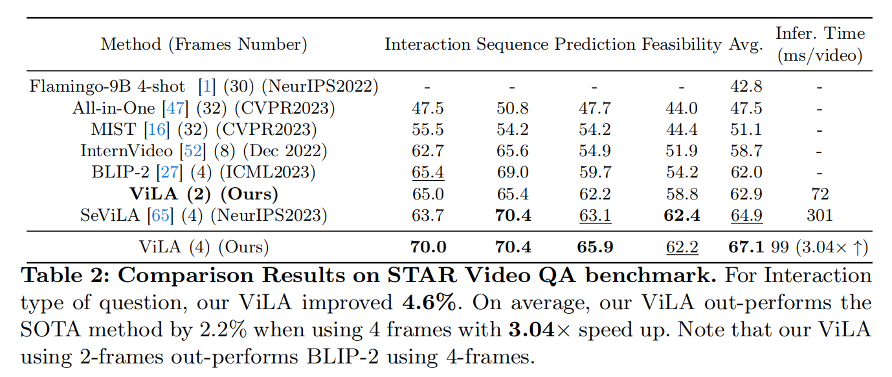
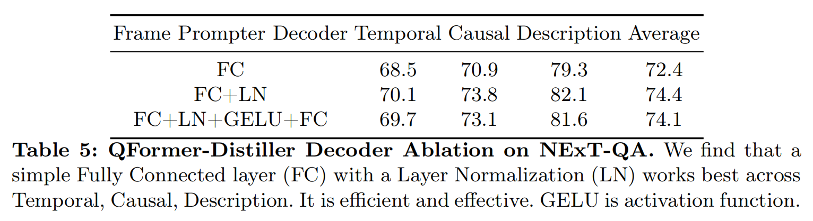

<font size=8>ViLA笔记</font>

[原文](https://arxiv.org/pdf/2312.08367)


<font size=5>**1 Introduction**</font>



`Frame-Prompter` 根据VQA loss来优化，去选取符合要求的合适的帧

在Qformer前加一个distillation（蒸馏器），构造 `QFormer-Distiller`，高效便捷得将视频信息迁移到LLM上

两个都是端到端训练


<font size=5>**2 Related Work**</font>

**Visual-Language Alignment**

HiTeA联合训练长视图和短视图对，以捕捉时刻和事件之间的时间关系。

Smaug引入稀疏图像块掩码，以减少预训练成本并改善跨模态对齐。

EgoVLPv2提出了骨干编码器之间的交叉注意力，以提高预训练效率和下游任务性能。


*Image-to-Video Transfer Learning*

相比之下，先前的很多做法是用预训练好的CLIP模型做文本-视频检索：

 增强帧层面的空间特征与时间信息，或者利用跨模态的相似性去计算以获得更好的视频语言对齐

或者在transformer中加入可训练的时间模块


<font size=5>**3 Method**</font>



对于老师网络，输入是所有帧的特征以及文本

而学生网络是经过Frame-Prompter选择出关键帧后以及文本输入

两个Loss：一个Distill loss去使得学生网络趋近于老师网络

另一个则是VQA loss，通过反向传播指导Frame Prompter去选择更准确的帧



关于Gumbel的补充：

```
Gumbel-Max Trick 的问题在于 argmax操作是不可导的。为了解决这个问题，Gumbel-Softmax 使用 Softmax 函数作为 argmax 的连续近似

Gumbel-Softmax 的优点
可导性：Gumbel-Softmax 是连续可导的，支持梯度反向传播。
灵活性：通过调整温度参数，可以控制采样的平滑程度。
广泛应用：适用于需要离散采样的任务，如强化学习中的动作选择、VAE 中的离散隐变量建模等。

Gumbel-Softmax 的局限性
近似误差：Gumbel-Softmax 是对离散采样的连续近似，可能存在一定的误差。

温度调参：温度参数 τ需要仔细调整，否则可能影响模型性能。
```

$y_{i}=\frac{exp((log p_{i}+g_{i})/\tau)}{\sum_{i=1}^{n} exp((log p_{i}+g_{i})/\tau)	}$

$p_{i}$ 概率分布

$g_{i}$ 是从 Gumbel 分布中采样的噪声

$\tau$ 是温度参数，控制平滑程度


这样就可以反向传播


**Text-guided Frame-Prompter Learning**

1.注意一开始没有对所有帧进行编码，而是均匀采样一部分，降低计算成本，然后进行均值池化操：每一帧变成N*1的形状

B  T  N  C->B  T  N

2.编码后切割为S个片段并将每个片段经过全连接层投射为

B  T  N->B  S  T//S*N->B  S  T//S

然后将这个给gumble-softmax计算得到掩码

具体过程即：

对每个segment进行softmax操作

$\pi=\{p_{k}|\frac{exp(s_{i})}{\sum_{j=1}^{S}exp(s_{j})}k\in [1,T/S], i,j\in [1,S]\}$

然后加入Gumble(0,1)分布

如果是推理:

$M_{k}=H(argmax[g_{k}+log p_{k}]) k\in [1,T/S]$

H是独热编码操作

如果是训练阶段,将argmax替换为softmax以此可以微分：

$\frac{exp((logp_{i}+g_{i})/\tau)}{\sum_{j=1}^{S}exp((logo_{j}+g_{j})/\tau)}\}, i,j\in [1,S]$

每个片段选出概率最大的，以此生成掩码


得到掩码后将之与原始的帧输入做点积（其实这就相当于在原始帧上选关键帧了）

然后将它与文本信息作CrossAttention

$X_{LLM}=CrossAttn(X*M,X_{t})$

$X_{t}$ 是 文本信息

$L_{vqa}=MSE(LLM(X_{LLM},X_{t}),QA_{answer})$


**Cross-Modal Distillation**

引入蒸馏模型来高效video-text融合

学生模型和老师模型都先经过一个cross attention:

$X^{'}=CrossAttn(E_{t}(X_{q}),SelfAttn(E_{v},q))$

q是可以学习的query token

然后将学生X经过解码器，然后有以下objective:

$L_{distill}=MSE(D(X^{'}_{student}),X^{'}_{teacher})$


<font size=5>**4 Experiments**</font>

用了8张 40GB的A100来训练


*在NExT-QA上的表现*



*在STAR Video QA上的表现*



对于蒸馏的解码器，选择上FC+LN最好：

